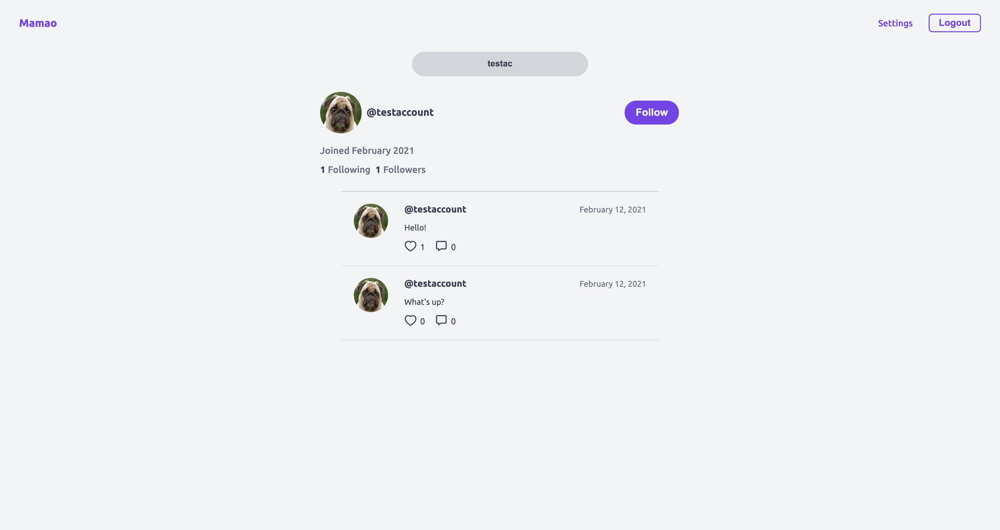
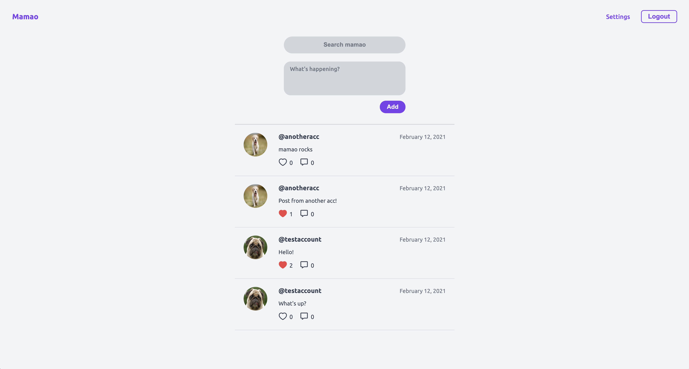

# Mamao--frontend

## Todo:
    - add comments
    - show comments

## How to run?

Before all, you have to run Mamao--backend: https://github.com/porithe/mamao--backend

when your backend service is ready just run:

```
npm install
npm start
```

## Some pics





